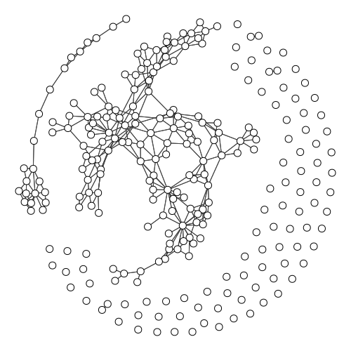

# Visualizing Land Borders of the World

Ever wondered what the world would look like if countries were nodes and borders were edges on a graph?

Probably not.

But now you can!

And not only does this script create some amazing "world maps", but it also performs a range of calculations that
may be useful for both the wannabe global leader and the professional Risk player, including but not limited to:

* shortest path from any country to any other country (lowest number of land border crossings)
* tier list of countries with the most borders
* unique color matching so no country has the same color as its neighbour

### Sample Images

